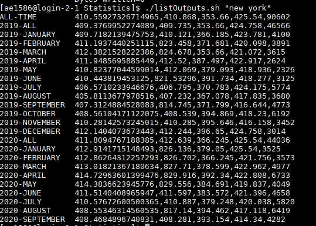

## Downloads:
### Original Datasource: https://oco2.gesdisc.eosdis.nasa.gov/data/OCO2_DATA/OCO2_L2_Lite_FP.10r/
The download scripts require that you setup an account with EarthData (https://urs.earthdata.nasa.gov/users/new) and setup system variables according to "curl for Mac/Linux" here (https://disc.gsfc.nasa.gov/data-access)

## Moving Data to HDFS:
1. The data is compressed into a tar file useing the "Compress Inputs" script.
2. SSH onto the dumbo server.
3. Use scp to download the tar file onto the dumbo server (using this method: https://www.urbaninsight.com/article/running-scp-through-ssh-tunnel).
4. Extract the data locally on the dumbo server (*tar -xf inputs.tar.gz*)
5. Use the hdfs put command to put the 2019 and 2020 input folders to the correct location on hdfs (*/project/input/2019, /project/input/2020*).

## General:
You may need to change the line ending mode to LF is it is set to CRLF before running these files.

## State Classification
* States are classified using a ray-casting approach from longitude and latitude values (https://en.wikipedia.org/wiki/Point_in_polygon)
* I've used the polygons generated here: https://github.com/LyleScott/google-maps-us-states-polygons/blob/master/coords.js converted into a text file
* The text file is loaded into the job cache and used by all the mappers
* Any data entry that does not belong to a US state is tallied under the key "OUTSIDE-US"
#### Some scripts/commands
* List the outputs - *./listOutputs.sh*
* Print output for california - "*./listOutputs.sh california*"
* Print output for california for 2020 - "*./listOutputs.sh california | grep "2020*"

## State Statistics
* I generate the following datapoints for each state:
  * Average CO2 PPM
  * Median CO2 PPM
  * Min CO2 PPM
  * Max CO2 PPM
  * Total Records
* For each of the following ranges of time: All time (2019-2020), Yearly, Monthly
#### Some scripts/commands
* List the outputs - *./listOutputs.sh*
* Print output for new york - "*./listOutputs.sh "new york"*"
  

# Data workflow
1. Download semi-processed data from NASA
2. Extract data into a text format
3. Compress and move to HDFS
4. Clean and Profile the data which outputs a cleaned data set
5. Run the State Classification job on the cleaned data set 
6. Run the Statistics job on the state-classified dataset
